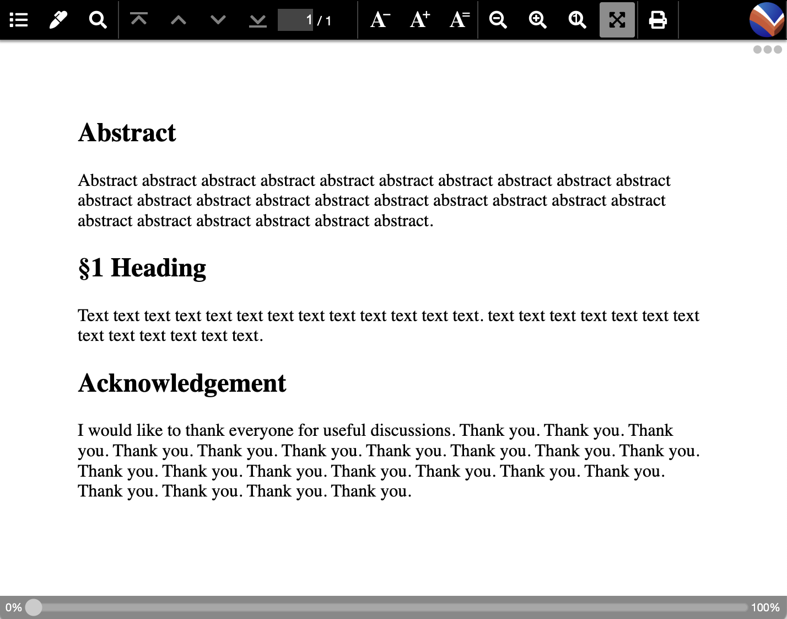

# Writing Academic Papers with VFM and Typesetting Them with Vivliostyle

Have you ever wanted to submit an academic paper typeset entirely using CSS? You're not alone—I’ve felt the same way for a long time. And more and more researchers are saying, “I want to write my papers in Markdown.”

[Vivliostyle](https://vivliostyle.org/) is an open-source library/application suite that brings CSS-based typesetting to life. It supports using Markdown as input, extended into a format called [VFM](https://gihyo.jp/article/2024/03/vivliostyle-02) (Vivliostyle Flavored Markdown).

But can you write a paper in VFM, typeset it with CSS, and submit that PDF to a conference? You may be wondering: *Can it handle the layouts typically seen in academic papers?* *What’s actually possible with CSS?*

This article explains how to recreate common academic layouts using CSS. It includes a full sample paper and modular layout snippets that you can run and modify. For example, you can preview a full paper written in Markdown (`sample.md`) with the Vivliostyle CLI like this:

```bash
$ vivliostyle preview sample.md
```

Or output it as a PDF like this:

```bash
$ vivliostyle build sample.md -o sample.pdf
```

Instructions for installing the Vivliostyle CLI are available in a previous article: [What Can Vivliostyle Do?](https://gihyo.jp/article/2024/01/vivliostyle-01#gh7iaq5CSJ)

## Design Philosophy of the Samples

The sample CSS and document structures prioritize ease of writing in VFM. The need to write raw HTML tags (like `<p>`) is minimized. Also, document elements are structured so they appear in the outline panel of typical Markdown editors.

In most samples, resizing the preview window will dynamically change the layout of figures and text. This is because page size is not fixed. You can define it in CSS like this:

```css
@page {
  size: A4 portrait;
}
```

Try resizing the preview window to observe layout behavior.

---

### Sections Covered in the Article:

- **Sample Full Paper**: Complete Markdown source + CSS that mimics a conference paper.
- **Language Settings**: How to set `lang="ja"` or `lang="en"` to control font selection and hyphenation.
- **Headings and Sections**: VFM generates `section` elements based on Markdown heading levels. How to control this and avoid unnecessary sectioning.
- **Author and Affiliation Blocks**: How to center author info without showing headings in the final PDF but still making them visible in the Markdown outline.
- **Multicolumn Layout**: How to do two-column layouts while keeping title and authors in a single-column format using page floats.
- **Figures and Tables**:
  - Numbering schemes with separate counters for figures and tables.
  - Placing multiple small figures/tables side by side using Flexbox.
  - Auto-generated captions.
  - Figures spanning columns (e.g., across two columns).
- **Appendices**: How to number sections in appendices as “A.1”, “A.2”, etc., with different styles from the main body.
- **Citations and References**:
  - Auto-updating section and figure references with `target-counter()` in CSS.
  - How to label and cross-reference items like “Figure 3” or “Section 2.1”.
- **Equations**: How to write inline and block-level math using LaTeX syntax or MathML.
- **Responsive Layouts**: How to make designs adapt when changing the preview window size.
- **Page Float for Figures**: For placing figures at the top or bottom of a page like in LaTeX.
- **Non-Numbered Sections**: Like Abstract, Acknowledgments, and References—how to exclude them from auto-numbering.


## Sample Full Paper

Complete Markdown source + CSS that mimics a conference paper.

Let’s start by looking at a sample of a complete academic paper.

- CSS file for a specific academic workshop: `ipsj-tech.css`  
- Manuscript file (in VFM format): `sample.md`  
- CSS file for table borders and alignment: `sample-table.css`  
- Output PDF generated from the build: `sample.pdf`

In this example, the CSS for aligning cells in the `table` element is placed in a separate file. Details about this approach are explained later in the section *“Aligning Table Columns”*.

Fig. 1: A part of the build PDF of the sample


Next, let’s go over some key layout techniques excerpted from the full sample.  
Please note that examples involving the insertion of pages with different sizes or orientations are not included in the full sample.

How to set `lang="ja"` or `lang="en"` to control font selection and hyphenation.

## Language of the Document and the `lang` Attribute

In HTML, the natural language of an element’s content (such as Japanese or English—not programming languages like HTML or TypeScript) is specified using the `lang` attribute. This setting influences decisions such as font selection and whether hyphenation is applied.

To ensure Japanese text uses appropriate Japanese fonts (e.g., for kanji), set `lang='ja'`. To enable hyphenation in English text, set `lang='en'`.

In all of the examples in this article, the overall document language is Japanese, so the `html` element is set to `lang='ja'`. In the full paper sample shown earlier, the “Abstract” is written in English, so `lang='en'` is used for that section. As a result, hyphenation is applied to words like “internationalization,” which may be broken as “interna-`(line break)`tionalization.”

To set the `lang` attribute on the `html` element in VFM, specify it in the frontmatter like this:

```yaml
---
lang: 'en'
---
```

## Headings and Section

VFM generates `section` elements based on Markdown heading levels. How to control this and avoid unnecessary sectioning.

### Headings and Sectioning

When designing CSS for writing papers in VFM, it’s important to understand that VFM automatically generates nested `section` elements based on the heading levels in Markdown (i.e., the number of `#` at the start of a heading line).  
([Sectioning in VFM](https://gihyo.jp/article/2024/03/vivliostyle-02#gh9ILAwmxz))

You can take advantage of this behavior for certain techniques, such as those described later in the section *“Hidden Headings.”*

However, care is needed. If you explicitly wrap a heading like `# Title` in an HTML tag such as `<header>`, like this:

```md
<header>

# Title

</header>
```

VFM will convert it to the following HTML:

```html
<body>
  <header>
    <section class="level1" aria-labelledby="Title">
      <h1 id="Title">Title</h1>
    </section>
  </header>
</body>
```

This means that “Title” becomes the heading of a `section` inside the `header` element. But `# Title` is converted into an `h1` element, which is intended to represent the heading of the entire `body`. So in this case, it becomes semantically incorrect.

To prevent VFM from generating a `section` element, end the heading line with the same number of `#` used at the beginning. For example:

```md
<header>

# Title #

</header>
```

This will be converted to the following HTML:

```html
<body>
  <header>
    <h1 id="Title">Title</h1>
    <p>Summary Summary Summary Summary Summary Summary Summary Summary Summary Summary</p>
  </header>
</body>
```

### Headings Without Numbers

Some headings—such as Abstract, Acknowledgments, References, and Appendices—are often displayed without numbering.  
This can be achieved by excluding these headings from the `counter` settings applied to heading elements like `h2`.

In the following VFM sample, the selector used with `counter-increment` is `h2:not(.abstract, .acknowledgement)`, which excludes headings with the `.abstract` and `.acknowledgement` classes using the `:not()` pseudo-class.

[sample11-1.css](sample/sample11-1.css)

```css
:root {
  counter-reset: section 0;
}
h2:not(.abstract, .acknowledgement) {
  counter-increment: section;
}
h2:not(.abstract, .acknowledgement)::before {
  content: "§" counter(section) " ";
}
```

[sample11-1.md](sample/sample11-1.md)

```md
---
lang: 'en'
link:
  - rel: 'stylesheet'
    href: 'sample11-1.css'
---

## Abstract{.abstract}

Abstract abstract abstract abstract abstract abstract abstract abstract abstract abstract abstract abstract abstract abstract abstract abstract abstract abstract abstract abstract abstract abstract abstract abstract abstract abstract。

## Heading

Text text text text text text text text text text text text text。text text text text text text text text text text text text text。

## Acknowledgement{.acknowledgement}

I would like to thank everyone for useful discussions. Thank you. Thank you. Thank you. Thank you. Thank you. Thank you. Thank you. Thank you. Thank you. Thank you. Thank you. Thank you. Thank you. Thank you. Thank you. Thank you. Thank you. Thank you. Thank you. Thank you. Thank you.
```

Fig. 2: sample11-1.md preview




# ここまで！ 2025-04-19 15:31


## Author and Affiliation Blocks 

How to center author info without showing headings in the final PDF but still making them visible in the Markdown outline.

## Multicolumn Layout 

How to do two-column layouts while keeping title and authors in a single-column format using page floats.

- **Figures and Tables**:
  - Numbering schemes with separate counters for figures and tables.
  - Placing multiple small figures/tables side by side using Flexbox.
  - Auto-generated captions.
  - Figures spanning columns (e.g., across two columns).

## Appendices 

How to number sections in appendices as “A.1”, “A.2”, etc., with different styles from the main body.

- **Citations and References**:
  - Auto-updating section and figure references with `target-counter()` in CSS.
  - How to label and cross-reference items like “Figure 3” or “Section 2.1”.

## Equations 

How to write inline and block-level math using LaTeX syntax or MathML.

## Responsive Layouts 

How to make designs adapt when changing the preview window size.

## Page Float for Figures 

For placing figures at the top or bottom of a page like in LaTeX.
## Non-Numbered Sections 

Like Abstract, Acknowledgments, and References—how to exclude them from auto-numbering.

Some special considerations are needed when working with headings.


---

### Final Notes

The article wraps up by discussing how styles may need to change depending on the journal or conference you’re submitting to. Even with identical content, differences in author affiliations or figure placement might require changes not just to the CSS but to the Markdown structure itself.
