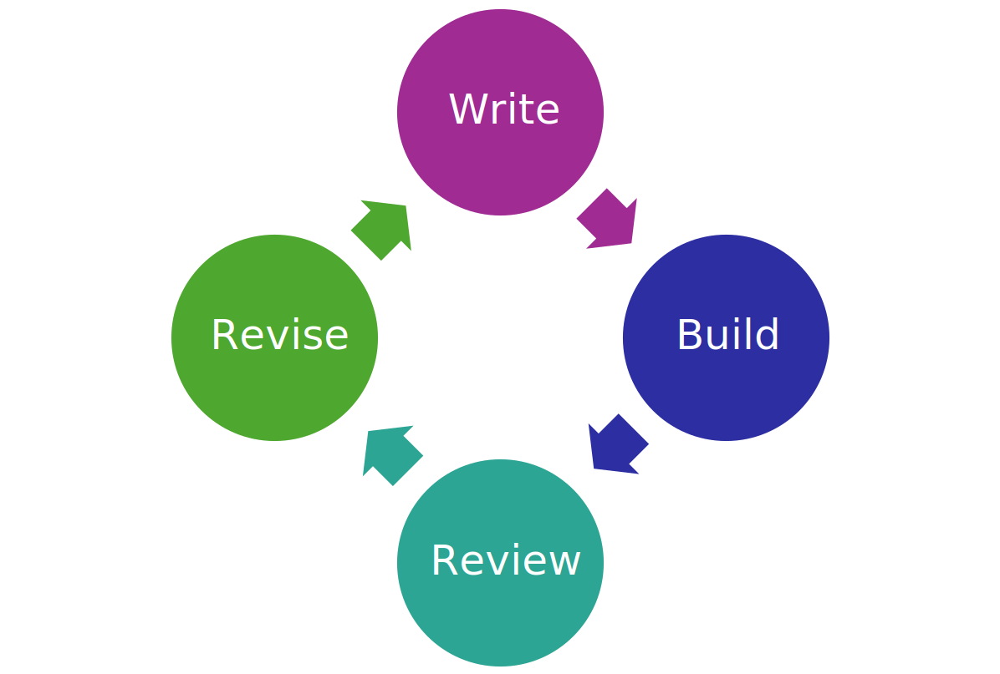

<figure id="fig01">
  

  <figcaption>キャプション1</figcaption>
</figure>

{.fig #fig02 style="height: 20vh;"}

<figure id="fig03">
  

  <figcaption>キャプション3</figcaption>
</figure>

{.fig-ref}は…。{.fig-ref}は…。{.fig-ref}は…